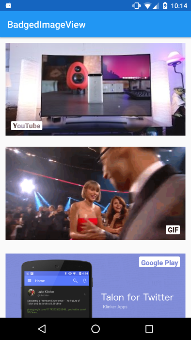

# Android BadgedImageView



Easily add badges to an `ImageView` to describe its content.

Recently, in [Talon for Twitter](https://github.com/klinker24/Talon-for-Twitter), one of my challenges was that you couldn't tell if media was a GIF, video, YouTube, etc. All the images just had the generic play button on them. This library, based off of [Plaid](https://github.com/nickbutcher/plaid), was my way to fix that.

Google+ uses a very similar style in their own app.

## Features

Place a badge over the top of the `ImageView` to describe its content.

 - Use any text you like
 - Change the badge color
 - Change the placement of the badge using `Gravity`
 - Change the padding on the badge

## Installation

There are two ways to use this library:

#### As a Gradle dependency

This is the preferred way. Simply add:

```groovy
dependencies {
    compile 'com.klinkerapps:badged_imageview:1.0.1@aar'
}
```

to your project dependencies and run `./gradlew build` or `./gradlew assemble`.

#### As a library project

Download the source code and import it as a library project in Eclipse. The project is available in the folder **library**. For more information on how to do this, read [here](http://developer.android.com/tools/projects/index.html#LibraryProjects).

## Example Usage

Functionality can be found in the example's [MainActivity](https://github.com/klinker24/Android-BadgedImageView/blob/master/example/src/main/java/com/klinker/android/badged_imageview_example/MainActivity.java). Badges on `BadgedImageView` can be added (or changed) from code:

```java
badgedIv.setBadge("YouTube", Color.RED);
badgedIv.setBadge("GIF"); // default badge color is white
```

or they can be defined in XML layout:
```xml
<com.klinker.android.badged_imageview.BadgedImageView
    android:id="@+id/badged_iv"
    android:layout_width="match_parent"
    android:layout_height="200dp"
    android:src="@drawable/gif"
    android:layout_margin="12dp"
    android:scaleType="centerCrop"
    app:badgeGravity="start|bottom"
    app:badgePadding="12dp"
    app:badgeColor="@android:color/white"
    app:badgeText="GIF" />
```

## Contributing

Please fork this repository and contribute back using [pull requests](https://github.com/klinker24/Android-BadgedImageView/pulls). Features can be requested using [issues](https://github.com/klinker24/Android-BadgedImageView/issues). All code, comments, and critiques are greatly appreciated.

## Changelog

The full changelog for the library can be found [here](https://github.com/klinker24/Android-BadgedImageView/blob/master/changelog.md).


## License

    Copyright 2016 Luke Klinker

    Licensed under the Apache License, Version 2.0 (the "License");
    you may not use this file except in compliance with the License.
    You may obtain a copy of the License at

       http://www.apache.org/licenses/LICENSE-2.0

    Unless required by applicable law or agreed to in writing, software
    distributed under the License is distributed on an "AS IS" BASIS,
    WITHOUT WARRANTIES OR CONDITIONS OF ANY KIND, either express or implied.
    See the License for the specific language governing permissions and
    limitations under the License.
